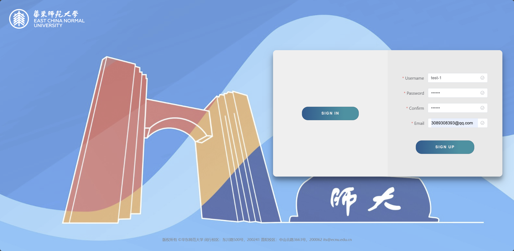
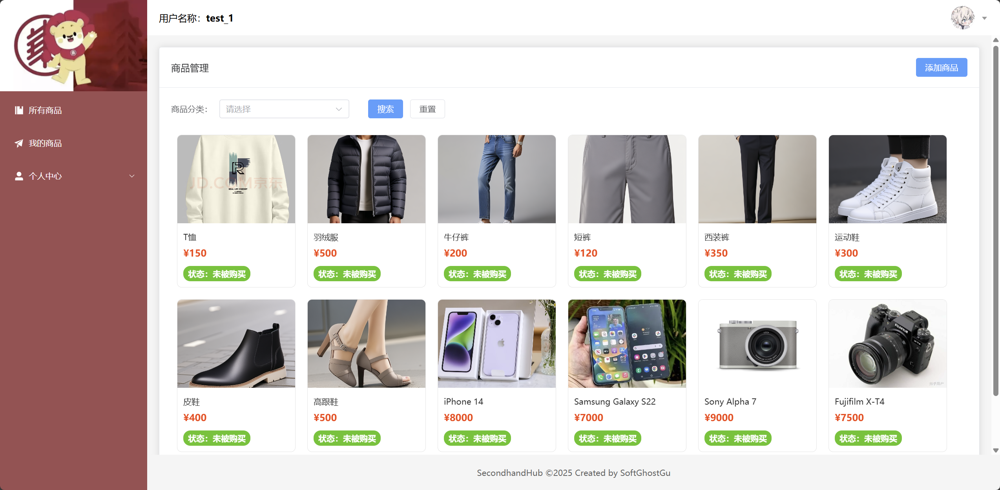
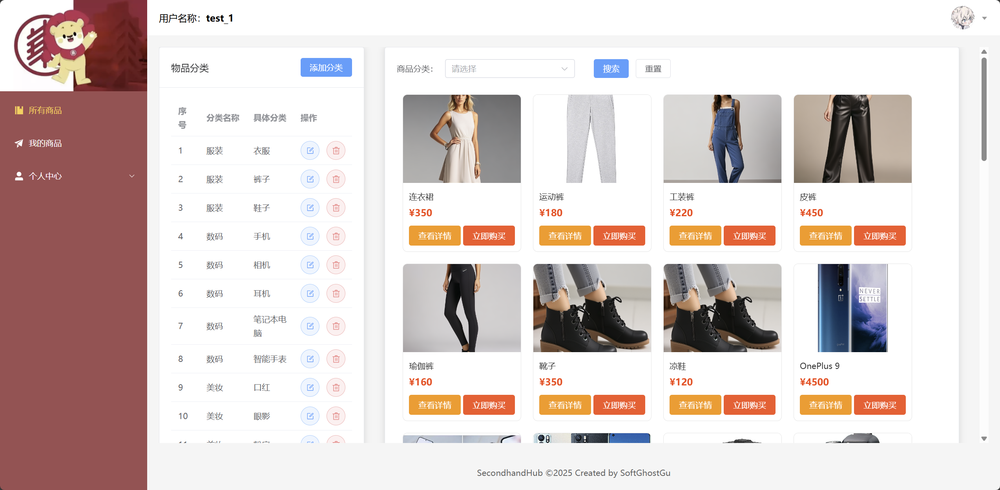
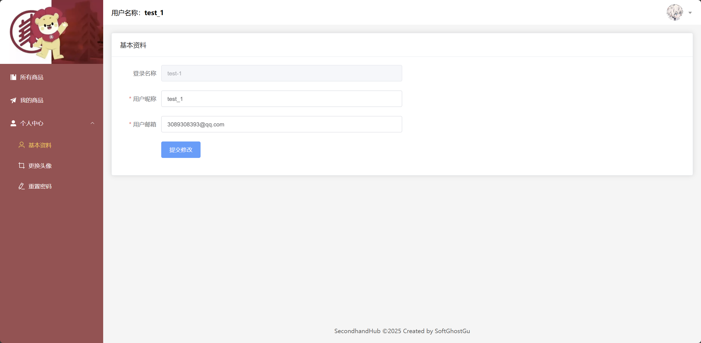
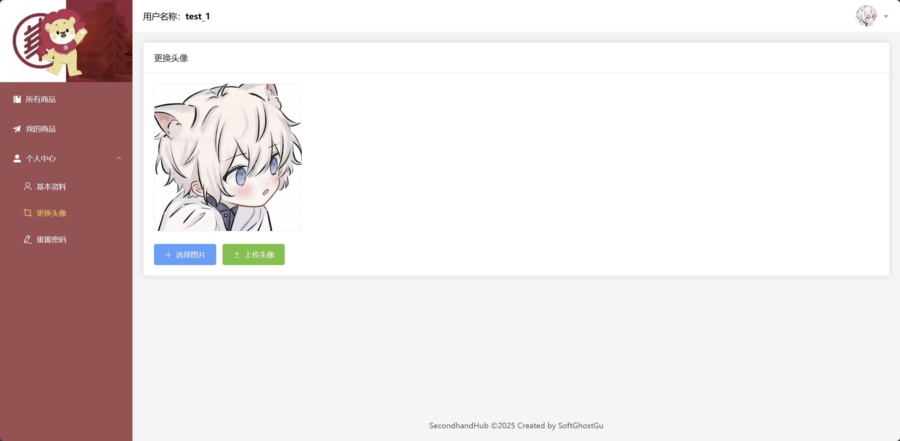
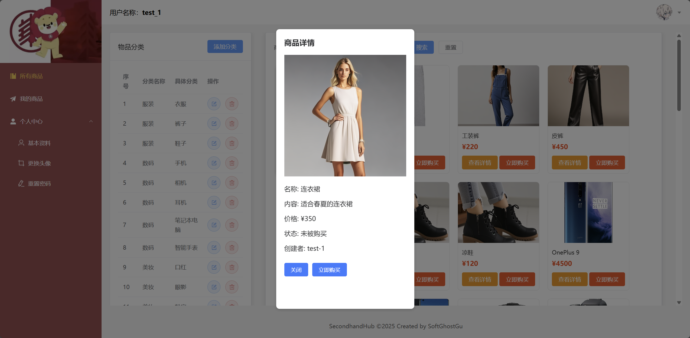
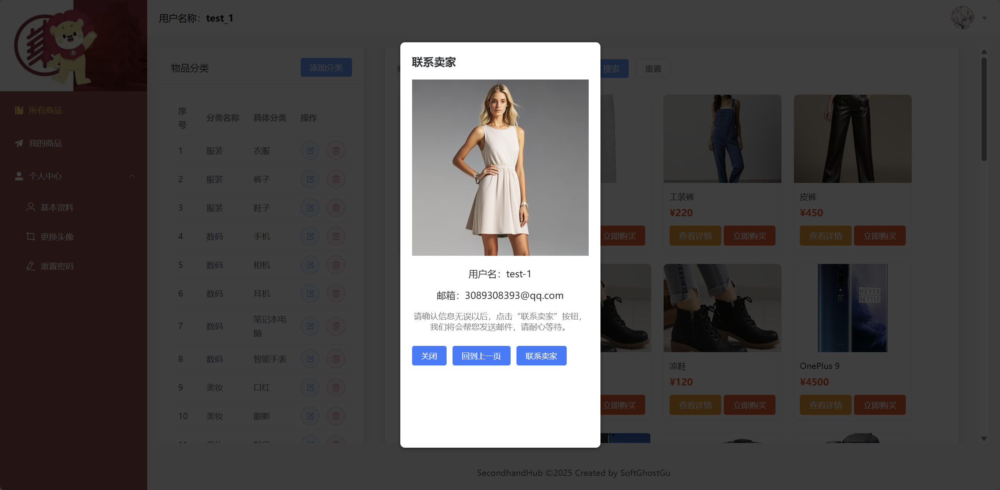

# 🛍️ 二手交易平台SecondHandHub

## 📌 项目简介

一个简易的二手交易平台（前后端新手练习使用）

这是一个基于 **前端 Vue** 构建的二手交易平台，用户可以发布二手商品、浏览商品、与卖家交流并完成交易。

## 🚀 功能特点
- 🛒 **商品发布**：用户可以上传商品信息、图片，并设置价格。
- 🔍 **商品浏览**：支持分类筛选、关键字搜索。
- 💬 **聊天系统**：支持买家与卖家以邮件方式聊天。
- 🔄 **订单管理**：查看历史订单、交易记录。
- 🔐 **用户认证**：登录注册、密码在数据库中加密等。

## 🏗️ 技术栈
- **前端**：Vue 3 + Vite + Pinia
- **后端**（可选）：Node.js + SpringBoot

## 📦 安装与运行
```bash
# 克隆项目
git clone git@github.com:SoftGhostGU/SecondHandHub.git

# 数据初始化（为了方便展示）：运行： 
SecondHandHub/backend/second_hand/database_script/SecondHand.sql

# 启动Redis：运行”SecondHandHub/backend/second_hand/redis-server.exe
# 从项目根目录下的cmd窗口中运行：
cd backend/second_hand/target
java –jar second_hand-1.0-SNAPSHOT.jar

# 回到根目录启动前端
cd fronted

# 安装依赖
npm install

# 运行项目
npm run dev
```

## 📜 目录结构
```
📂 SecondHandHub
 ├── 📁 backend  # 后端
 │   ├── 📁 second_hand
 │   │   ├── 📁 src
 │   │   │   ├── 📁 main
 │   │   │   │   ├── 📁 java/com/GHOST
 │   │   │   │   │   ├── 📁 anno
 │   │   │   │   │   ├── 📁 config
 │   │   │   │   │   ├── 📁 controller
 │   │   │   │   │   ├── 📁 exception
 │   │   │   │   │   ├── 📁 interceptors
 │   │   │   │   │   ├── 📁 mapper
 │   │   │   │   │   ├── 📁 pojo
 │   │   │   │   │   ├── 📁 service
 │   │   │   │   │   ├── 📁 utils
 │   │   │   │   │   ├── 📁 validation
 │   │   │   │   │   ├── 📄 SecondHandApplication.java # 启动类
 │   │   │   │   ├── 📁 resource
 │   │   │   │   │   ├── 📁 com/GHOST/mapper
 │   │   │   │   │   │   ├── 📄 GoodsMapper.xml
 │   │   │   │   │   ├── 📄 application-dev.yml
 │   │   │   │   │   ├── 📄 application-pro.yml
 │   │   │   │   │   ├── 📄 application-test.yml
 │   │   │   │   │   ├── 📄 application.yml
 │   │   │   ├── 📁 test
 │   │   ├── 📁 target
 │   │   ├── 📄 pom.xml
 ├── 📁 fronted  # 前端
 │   ├── 📁 .vscode
 │   ├── 📁 node_modules
 │   ├── 📁 public
 │   ├── 📁 src
 │   │   ├── 📁 api
 │   │   ├── 📁 assets
 │   │   ├── 📁 components
 │   │   ├── 📁 router
 │   │   ├── 📁 stores
 │   │   ├── 📁 utils
 │   │   ├── 📁 views
 │   │   │   ├── 📁 goods
 │   │   │   │   ├── 📄 GoodsCategory.vue
 │   │   │   │   ├── 📄 GoodsManage.vue
 │   │   │   ├── 📁 user
 │   │   │   │   ├── 📄 UserAvatar.vue
 │   │   │   │   ├── 📄 UserInfo.vue
 │   │   │   │   ├── 📄 UserResetPassword.vue
 │   │   │   ├── 📄 Layout.vue
 │   │   │   ├── 📄 Login.vue
 │   │   ├── 📄 App.vue
 │   │   ├── 📄 main.js
 │   ├── 📄 .gitignore
 │   ├── 📄 index.html
 │   ├── 📄 package-lock.json
 │   ├── 📄 package.json
 │   ├── 📄 README.md
 │   ├── 📄 vite.config.js
 ├── 📁 profile_photo  # 部分图片
 └── 📄 README.ms
```

## 🎨 界面预览

### 登录注册页面




## 我的商品页面



## 商品搜索页面



## 用户信息页面



## 用户头像页面



## 商品信息页面



## 购买商品页面



## 接收邮件页面


## 📌 未来计划
- ✅ **优化 UI 设计**
- ✅ **增加竞价功能**
- ✅ **支持加密货币支付**（结合区块链智能合约）
- ✅ **提供 API 接口，支持第三方集成**

## 🤝 贡献指南

📧 **联系邮箱**：3089308393@qq.com

